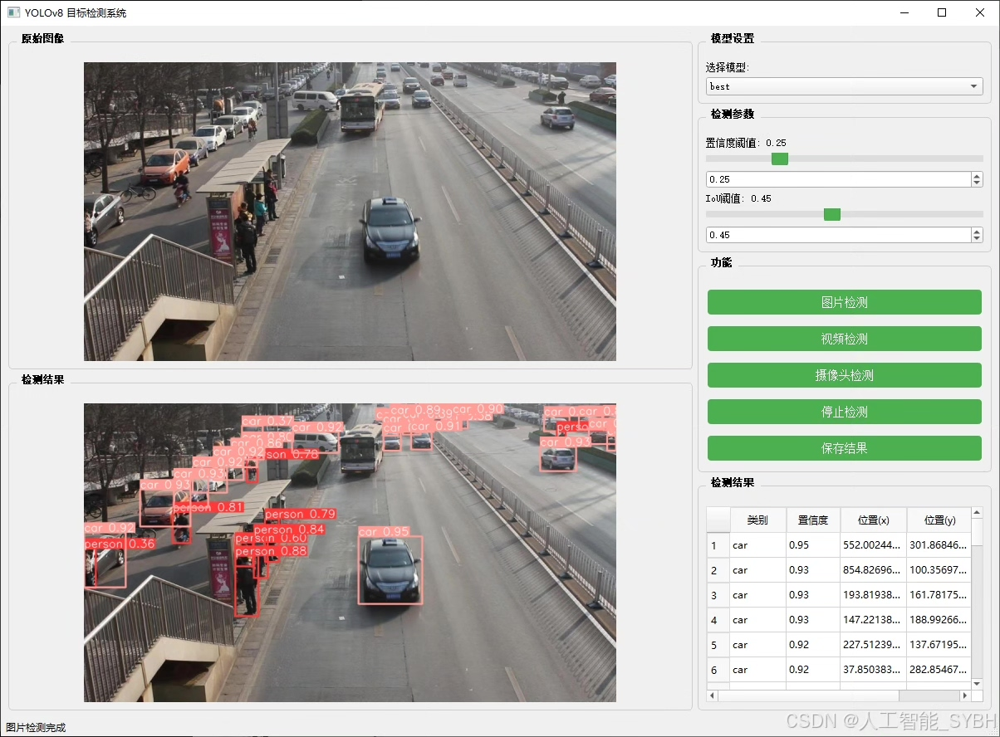
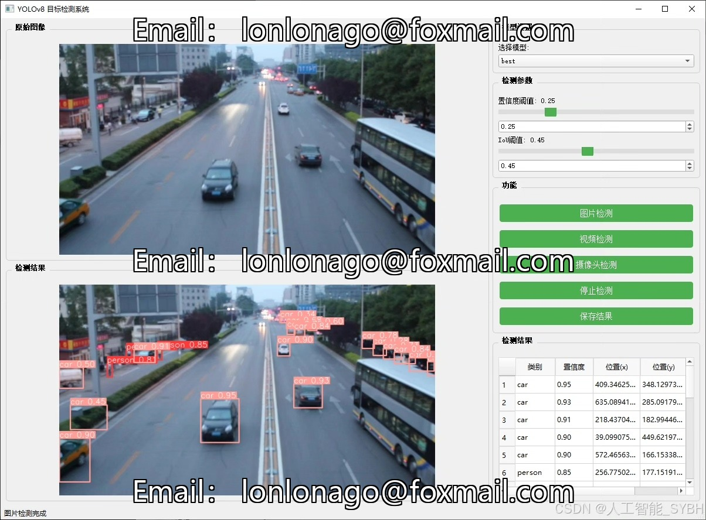
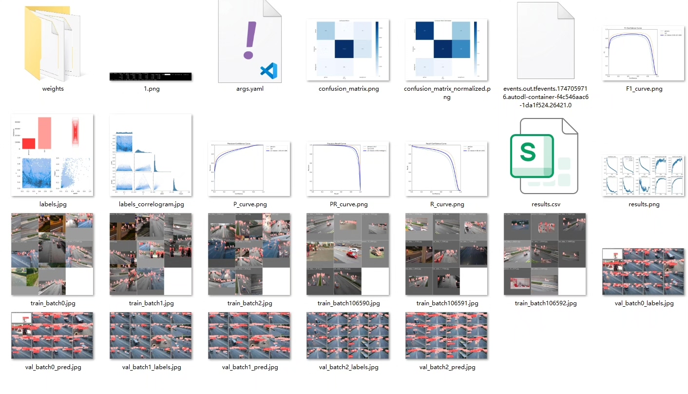
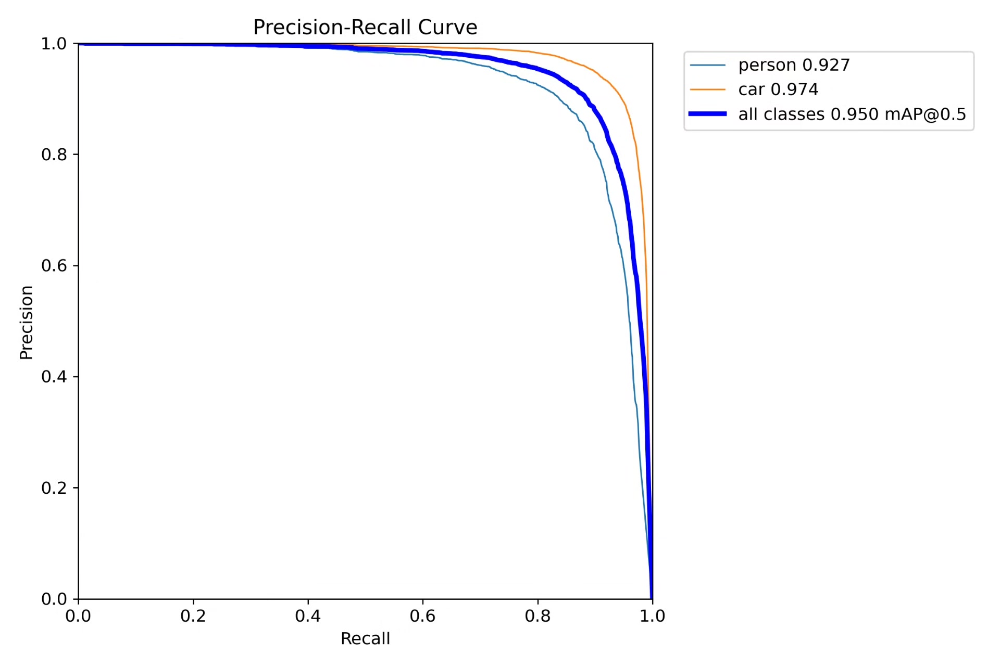
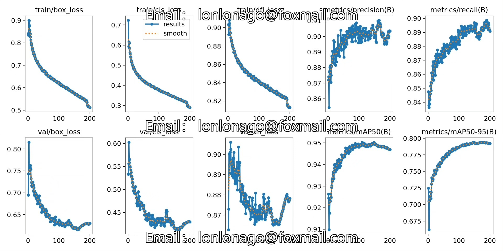
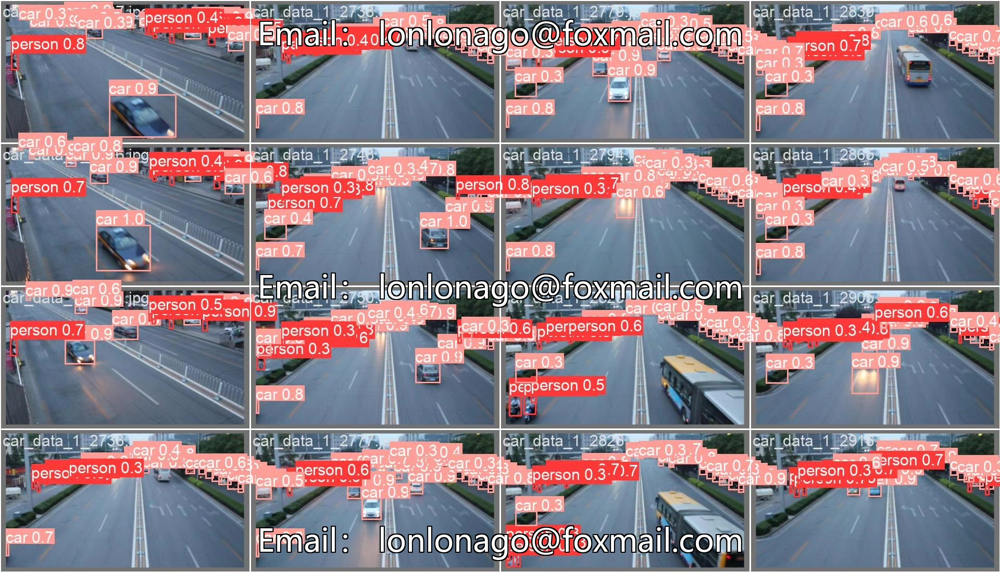
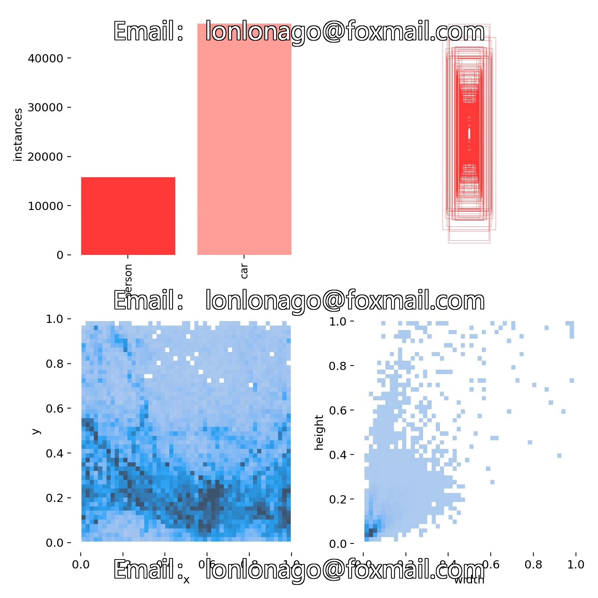
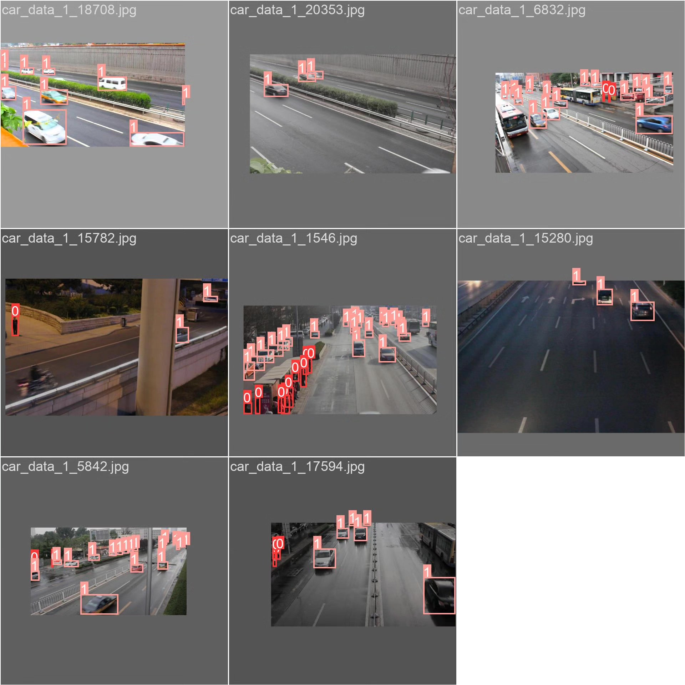

# Vehicle and pedestrian detection system based on deep learning YOLOv8+Y

## Body

Based on the advanced YOLOv8 object detection algorithm, this project has developed a smart visual system specifically for vehicle and pedestrian detection. The system utilizes deep learning techniques and employs a dataset containing 5607 labeled images (4485 training set, 1122 validation set) for model training, enabling real-time and accurate recognition of "person" (pedestrians) and "car" (vehicles) in the scene. The system achieves high detection accuracy and real-time performance, which can be widely applied in intelligent traffic monitoring, autonomous driving assistance, and smart city construction among other fields. Through data augmentation and model optimization techniques, the system still achieves good detection results even with limited dataset size, providing a reliable solution for target detection needs in practical application scenarios.

The company's products have obtained YOLO official commercial license certification.

Package after-sales service: After payment, we will provide WeChat ID for instant questions and answers.

Environment configuration: A tutorial on environment configuration will be provided, and WeChat will offer答疑.

Remote installation service: If you need remote configuration, an additional fee of 69 is required, with all fees refunded if the configuration fails (only reimbursement for old computers).

Retraining dataset: Once the environment is configured, you can train on your own computer. If you need us to retrain, just pay 69 plus computing power fees (2.5 yuan/hour).

Full after-sales service

## Images

## Payment

Here is a pay link on Stripe ( https://buy.stripe.com/3cs8yP7sY87d0vu9AB ). Please contact me lonlonago@foxmail.com after funding $89, and I will send you a complete data files , thank you!

